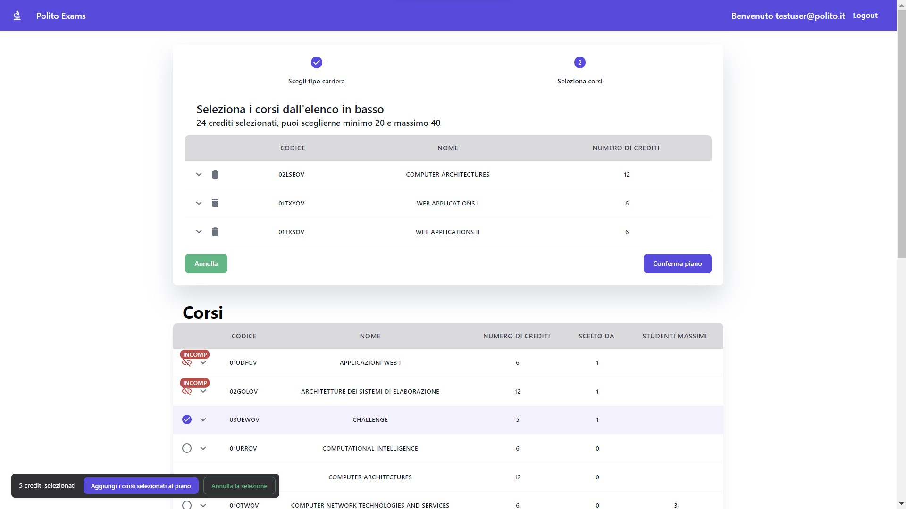

# Exam #1: "Piano di Studi"
## Student: s296138 CARACHINO ALESSIO

## React Client Application Routes

- Route `/`: This route can only be accessed by unauthenticated students. In its body, it shows the list of all courses in read-only mode.
- Route `/login`: Unauthenticated students can reach this page once they have clicked on the Login Button of the top navbar which can be reached at all routes. It provides a form, with two required fields: email and password. The email field is validated by a function of a popular library, while the password can be checked by the student.
- Route `/home`: Unauthenticated students are not able to access this route. It shows the study plan (create mode/edit mode and delete) and the list of all offered courses.


## API Server

- GET `/api/courses` __Get all offered courses__
  - response body:
  ```
  [
    {
        "code": "01UDFOV",
        "name": "Applicazioni Web I",
        "credits": 6,
        "max_students": null,
        "incompatibility": [
            "01TXYOV"
        ],
        "mandatory": null,
        "pickedBy": 1
    },
    {
        "code": "02GOLOV",
        "name": "Architetture dei sistemi di elaborazione",
        "credits": 12,
        "max_students": null,
        "incompatibility": [
            "02LSEOV"
        ],
        "mandatory": null,
        "pickedBy": 1
    },
  ...
  ]
  ```

- GET `/api/studyplan` __Returns the study plan of the student__
  - response body:
  ```
  {
    "isFulltime": false,
    "planItems": [
        {
            "code": "01UDFOV"
        },
        {
            "code": "02GOLOV"
        },
        ...
    ]
  }
  ```

- POST `/api/confirmStudyPlan` __Validate and eventually Store in the database the created/edited study plan of the student__
  - request body content:
  ```
  {
  "planItems": [
  "01UDFOV",
  "02GOLOV",
  "03UEWOV",
  "01URROV"
  ],
  "isFulltime": false
  }
  ```
- DELETE `/api/deleteStudyPlan` __Request to delete the student's study plan__
  - credentials included

- POST `/api/sessions` __Login request__
  - request body content:
  ```
  {
    "email": "testuser@polito.it",
    "password": "password"
  }
  ```

- GET `/api/sessions/current` __Retrieves the session, if any, of the student__
  - credentials included

- DELETE `/api/sessions/current` __Logout request__
  - credentials included


## Database Tables

- Table `students` - contains all students -> | id | email | name | hash | salt |
- Table `courses` - contains all offered courses -> | code | name | credits | max_students | incompatibility | mandatory |
- Table `students_courses` - contains, basically, the study plans -> | student_id | course_code | is_fulltime |


## Main React Components

- `HomePageComp` (in `HomePageComp.js`): Only logged students can access it. According to their interactions and persistent data, it shows them, their study plan (read/edit) and all courses.
- `CreatePlanStepper` (in `CreatePlanStepper.js`): It is eventually rendered in `HomePageComp`, it guides the student to create its study plan.
- `EditPlanStepper` (in `EditPlanStepper.js`): It is eventually rendered in `HomePageComp`, it guides the student to edit/delete its study plan.
- `StudyPlanTableComp` (in `StudyPlanTableComp.js`): It represents the study plan of the students. Depending on the interactions of the student, it can show both persistent and local data.
- `CoursesTableReadOnlyComp` (in `CoursesTableReadOnlyComp.js`): It is rendered for unauthenticated students in `App.js`. It shows a table where there are all offered courses. 
- `IconBadgeErrorComp` (in `IconBadgeErrorComp.js`): It is rendered in `CoursesTableItemComp`. It shows an icon that reflects the state of the course (already in plan / cannot be added in the study plan since there is an incompatible course / cannot be added in the study plan since its preparative exam has not been added yet).


## Screenshot



## Users Credentials

- john.doe@polito.it, password
- mario.rossi@polito.it, password
- testuser@polito.it, password
- polito.exams@polito.it, password
- nome.cognome@polito.it, password

## Current study plans
- john.doe@polito.it, part-time
- mario.rossi@polito.it, part-time
- testuser@polito.it, full-time

